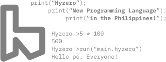

[](img/svg/README.md)
[](img/svg/README.md)
# [](https://github.com/magayaga/hyzero)

**Hyzero** (also known as **Hydrogen Zero** or **H0**) is a high-level, interpreted, general-purpose programming language created, designed, and developed by [Cyril John Magayaga](https://github.com/magayaga). It is the **Philippines’ first creating programming language in the twenty-first country**, after **one of the Philippines’ first easiest programming languages**. This is like **_Python_** programming language.

Hyzero loves [**BASIC** (**Beginners' All-purpose Symbolic Instruction Code**)](https://en.wikipedia.org/wiki/BASIC) family of the programming language.



## Documentation

Read the [Get Started](docs/Get_started.md) and [Download](docs/Download.md).

## Examples

The following shows how the simple **Hello, World!** program was written in **Hyzero**.

- Hyzero programming language in original version (**v0.0.1 - v0.0.3**):

  ```python
  print("Hello, World!")
  ```
- Hyzero programming language in current version (**v0.1.0** - _present_):

  ```rust
  write("Hello, World!")
  ```

- Hyzero programming language as **Output**:
  ```
  Hello, World!
  ```

How can I add a `VAR` variable to `write()`?
- The `write()` function prints the given object to the standard output device (screen) or to the text stream file.

  ```python
  VAR hi = "Hello, World!"
  write(hi) 
  ```

## History

### 1. New programming language of the Asia (2022-present)
Hyzero was created on July 25, 2022, by [Cyril John Magayaga](https://github.com/magayaga). It is the Philippines' second programming language. [Bato](https://github.com/jjuliano/bato) programming language is a Philippines' first programming language created by [Joel Bryan Juliano](https://github.com/jjuliano).

The Hyzero documents, design, implementation, and related tools are hosted on GitHub private under the OpinionOne version 2.

**On July 30, 2022**, Cyril John Magayaga said __Hyzero__ was a new programming language like calculator, command language, computer program, and upcoming application.

**On August 5, 2022**, Cyril John Magayaga announced that __Hyzero__ become new high-level and general-purpose programming language, and the Philippines’ first easiest programming languages. The new filename extension on .hyzero is called the source code of a program. 

**On August 6, 2022**, Cyril John Magayaga announced that __Hyzero__ programming languages like __Python__. The _Hyzero 0.1_ was released on __August 15, 2022__, with many major new features.

**On August 13, 2022**, Cyril John Magayaga announced that __Hyzero__ programming language, new features of Hyzero in the Philippines.

**On August 24, 2022**, Cyril John Magayaga announced that __Hyzero__ programming language, written in **Python** programming language (High-level, Interpreted, & General-purpose) and **C** programming language (Binary). 

Not to be confused with [**_Hy_**](https://github.com/hylang/hy) _programming language_ and don't known as **_Zero_** _programming language_.

__Hyzero__ programming language become **Strong** and **Dynamic** programming language. `.hyzero` was real file extension of **Hyzero**.

**On August 30, 2022**, Cyril John Magayaga announced that __Hyzero__ programming language become _public open-source projects_.

**On March 19, 2023**, Cyril John Magayaga says [**_pythOwO_**](https://github.com/virejdasani/pythOwO) programming language, It should be fixed and it is english language.

### Build of the Hyzero
There are a few languages that have followed this model for other ecosystems, and Hyzero aims to fill an analogous role for Python:

* C → C++
* JavaScript → TypeScript
* Java → Kotlin
* C++ → Carbon
* Python → **_Hyzero_**

## Getting started

Download the [Python](https://python.org/downloads) programming language.

To build the **Hyzero** explorer yourself, follow these instructions:

### Windows
```shell
# Download the Hyzero's code
$ git clone https://github.com/Magayaga/Hyzero.git
$ cd Hyzero

# Download the Python
$ choco install python

# Run the explorer
$ python src/hyzero.py explorer/testdata/math/math.hyzero
$ python src/hyzero.py explorer/testdata/print/pyramid.hyzero

# Run the shell
$ python src/shell.py
Hyzero v0.1.6-beta2 (September 9, 2023) - created & developed by Cyril John Magayaga
Hyzero > write("Hello, World!")
```

### macOS and Linux
```shell
# Download the Hyzero's code on macOS and Linux
$ git clone https://github.com/Magayaga/Hyzero.git
$ cd Hyzero

# Download the Python on macOS
$ brew install python3

# Download the Python on Linux
$ sudo apt-get install python3 # Ubuntu or Debian
$ sudo dnf install python3 # Fedora or Red Hat

# Run the explorer
$ python3 src/hyzero.py explorer/testdata/math/math.hyzero
$ python3 src/hyzero.py explorer/testdata/print/pyramid.hyzero

# Run the shell
$ python3 src/shell.py
Hyzero v0.1.6-beta2 (September 9, 2023) - created & developed by Cyril John Magayaga
Hyzero > write("Hello, World!")
```

## Copyright & License

### Copyright: 
* Copyright 2022-2023 [Cyril John Magayaga](https://github.com/magayaga)
* Copyright 2001-2023 [Python Software Foundation](https://www.python.org/psf/)

### License:
The **Hyzero** documents, design, implementation, and related tools are hosted on **GitHub public** under the [**OpinionOne (Latest Version 2)**](LICENSE).

