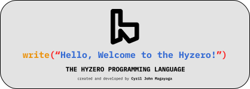

[](img/svg/README.md)
[](img/svg/README.md)
# [](https://github.com/magayaga/hyzero)

**Hyzero** (also known as **Hydrogen Zero** or **H0**) is a high-level, interpreted, general-purpose programming language created, designed, and developed by [Cyril John Magayaga](https://github.com/magayaga). It is the **Philippines’ first creating programming language in the twenty-first country**, after **one of the Philippines’ first easiest programming languages**. This is like **_Python_** programming language.

Hyzero loves [**BASIC** (**Beginners' All-purpose Symbolic Instruction Code**)](https://en.wikipedia.org/wiki/BASIC) family of the programming language.



## Documentation

Read the [Get Started](docs/Get_started.md) and [Download](docs/Download.md).

## Examples

1. The following shows how the simple **Hello, World!** the app is written in **Hyzero**.

Hyzero programming language in original version (**v0.0.1 - v0.0.3**):

```python
print("Hello, World!")
```
Hyzero programming language in current version (**v0.1.0** - _present_):

```rust
write("Hello, World!")
```

Hyzero programming language as **Output**:
```
Hello, World!
```
## History

### 1. New programming language of the Asia (2022-present)
Hyzero was created on July 25, 2022, by [Cyril John Magayaga](https://github.com/magayaga). It is the Philippines' second programming language. [Bato](https://github.com/jjuliano/bato) programming language is a Philippines' first programming language created by [Joel Bryan Juliano](https://github.com/jjuliano).

The Hyzero documents, design, implementation, and related tools are hosted on GitHub private under the OpinionOne version 2.

**On July 30, 2022**, Cyril John Magayaga said __Hyzero__ was a new programming language like calculator, command language, computer program, and upcoming application.

**On August 5, 2022**, Cyril John Magayaga announced that __Hyzero__ become new high-level and general-purpose programming language, and the Philippines’ first easiest programming languages. The new filename extension on .hyzero is called the source code of a program. 

**On August 6, 2022**, Cyril John Magayaga announced that __Hyzero__ programming languages like __Python__. The _Hyzero 0.1_ was released on __August 15, 2022__, with many major new features.

**On August 13, 2022**, Cyril John Magayaga announced that __Hyzero__ programming language, new features of Hyzero in the Philippines.

**On August 24, 2022**, Cyril John Magayaga announced that __Hyzero__ programming language, written in **Python** programming language (High-level, Interpreted, & General-purpose) and **C** programming language (Binary). 

Not to be confused with [**_Hy_**](https://github.com/hylang/hy) _programming language_ and don't known as **_Zero_** _programming language_.

__Hyzero__ programming language become **Strong** and **Dynamic** programming language. `.hyzero` was real file extension of **Hyzero**.

**On August 30, 2022** Cyril John Magayaga announced that __Hyzero__ programming language become _public open-source projects_.

### Build of the Hyzero
There are a few languages that have followed this model for other ecosystems, and Hyzero aims to fill an analogous role for Python:

* C → C++
* Visual Basic → Visual Basic .NET
* JavaScript → TypeScript
* Java → Kotlin
* MATLAB → Julia
* Objective-C → Swift
* Python → **_Hyzero_**

## Getting started

Download the [Python](https://python.org/downloads) programming language.

To build the **Hyzero** explorer yourself, follow these instructions:

```shell
# Download the Hyzero's code
$ git clone https://github.com/Magayaga/Hyzero.git
$ cd Hyzero

# You are choose the make or gcc
$ gcc hyzero-help.c -o hyzero-help
$ make hyzero-help
$ ./hyzero-help

# Run the explorer
$ python hyzero.py explorer/testdata/math/math.hyzero
$ python hyzero.py explorer/testdata/print/pyramid.hyzero

# Run the shell
$ python shell.py
Hyzero v0.1.6-beta1 (February 19, 2023) - created & developed by Cyril John Magayaga
Hyzero > write("Hello, World!")
```

## Copyright & License

### Copyright: 
* Copyright 2022-2023 [Cyril John Magayaga](https://github.com/magayaga)
* Copyright 2001-2023 [Python Software Foundation](https://www.python.org/psf/)

### License:
The **Hyzero** documents, design, implementation, and related tools are hosted on **GitHub public** under the **OpinionOne (Latest Version 2)**.

